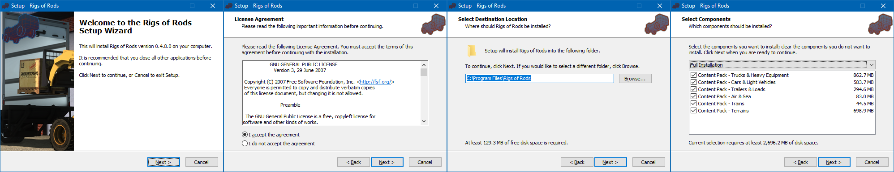
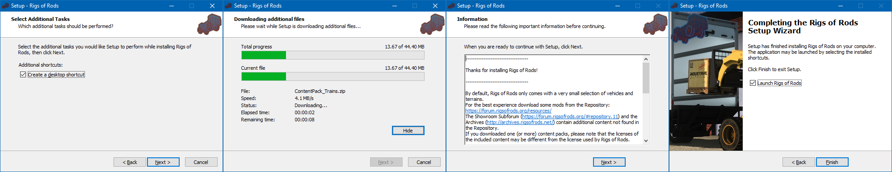
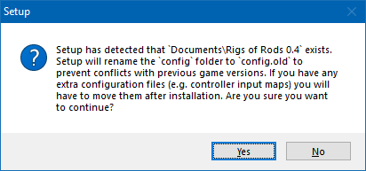

Rigs of Rods Installer, built using Inno Setup.

Features:
- Currently installs 0.4.8 RC4
- Supports 32-bit (x86) and 64-bit (x64)
- Content pack(s) download & installation
- Detect & rename `Documents\Rigs of Rods 0.4\config` folder to prevent conflicts with older game versions 

Screenshots:

